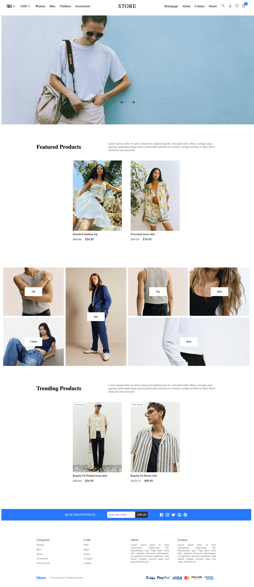
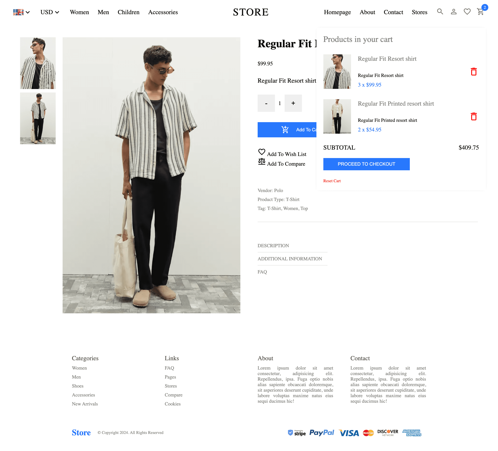
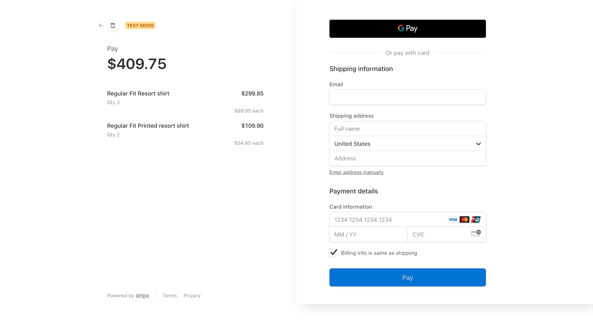

# E-commerce Application Based on React, Strapi, and Stripe

This project is an e-commerce application developed using React for the front-end, Strapi for the back-end, and Stripe for payment processing. The application features a complete shopping experience, including user navigation, product listing, and a shopping cart.

## Features

- Front-end interface developed using React
- Page routing management using React Router
- Backend data storage and management using Strapi
- Data retrieval from Strapi using Axios, with encapsulated request process for simplified operations
- State management using Redux Toolkit for implementing shopping cart functionality
- Integration with Stripe for secure payment processing, ensuring a smooth user experience

## Technologies Used

- React: A JavaScript library for building user interfaces
- Strapi: An open-source headless CMS for backend data management
- Stripe: A payment processing platform for secure online transactions
- Redux Toolkit: A state management library for efficient Redux development
- React Router: A routing library for declarative navigation in React applications
- Axios: A promise-based HTTP client for making API requests

## Demo

Here are some screenshots showcasing the e-commerce application:

*Homepage*

  

*Category page*

  

*Product detail with shopping cart*

  

*Checkout page*

  

## YouTube Tutorial

This project was developed by following a tutorial on YouTube. You can find the tutorial video here: [YouTube Tutorial](https://www.youtube.com/watch?v=BCkWFblNLKU&t=11441s)

## Getting Started

To run this project locally, follow these steps:

1. Clone the repository: `git clone https://github.com/lost-komorebi/react-strapi-stripe-mall.git`
2. Install the dependencies: `npm install`
3. Set up a Strapi project and configure the necessary credentials
4. Set up a Stripe account and obtain the required API keys
5. Configure the Stripe API keys in the application
6. Start the development server: `npm start`
7. Open the application in your browser at `http://localhost:5173`

## Contributing

Contributions are welcome! If you find any bugs or have suggestions for improvements, please open an issue or submit a pull request.
